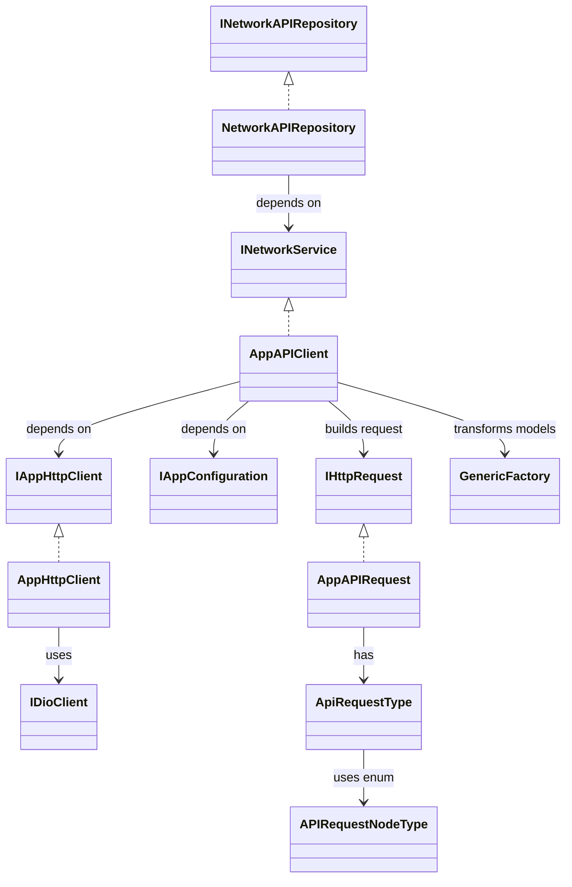

# Rest API Data Layer in Flutter using abstraction, layered architecture and depencency injection

# Data Layer Documentation

This documentation describes the architecture, abstractions, and flow of the `data_layer` in the PR [#1: added domain layer and data layer](https://github.com/aseemaggarwal89/resuable_network_layer/pull/1). The design leverages dependency injection, interfaces, and enums to provide a scalable, maintainable, and testable REST API client.

---

## Overview

The data layer is responsible for:

- Abstracting network communication from domain and presentation layers.
- Providing a scalable and configurable REST API client.
- Enabling easy addition of new API endpoints via enums and abstraction.
- Handling deserialization, error mapping, and environment configuration.
- Facilitating unit testing and code reusability by using dependency injection and interfaces.

---

## Core Concepts & Classes

### 1. Abstraction & Interfaces

#### IHttpRequest

- **Role:** Defines the contract for creating REST API requests.
- **Purpose:** Allows for multiple implementations, enabling extensibility.

#### INetworkService

- **Role:** Abstracts network request execution.
- **Main Method:**
  ```dart
  Future<ApiResult<T>> loadRequest<T>(IHttpRequest request);
  ```
- **Purpose:** Allows repositories to issue requests without knowing implementation details.

#### IAppHttpClient

- **Role:** Abstraction over HTTP client (e.g., Dio).
- **Purpose:** To execute requests and return raw or JSON data.

#### IAppConfiguration

- **Role:** Abstraction for environment configuration.
- **Purpose:** Provides base URLs and other environment-dependent values.

#### INetworkAPIRepository

- **Role:** The only interface exposed to the domain and presentation layers.
- **Purpose:** Offers high-level methods for different endpoints, abstracting all lower-level networking details.

---

### 2. Implementations

#### AppAPIRequest (implements IHttpRequest)

- **Role:** Concrete implementation for building REST API requests.
- **Composition:** Uses `ApiRequestType` to configure requests dynamically.

#### ApiRequestType (abstract class)

- **Role:** Abstracts multiple request types/endpoints.
- **Endpoint Selection:** Uses `APIRequestNodeType` enum.
- **Methods:** 
  - `customHeaders()`
  - `accessTokenHeaders()`
  - `isContentLengthHeaderRequired()`
  - `responseType()`
  - `nodeUrlEndPoint()`
- **Pattern:** Each method uses a `switch-case` on the enum for dynamic configuration.

#### APIRequestNodeType (enum)

- **Role:** Defines all REST API node types/endpoints.
- **Purpose:** Adding a new endpoint requires only a new enum value and corresponding switch-case logic, leading to high configurability and readability.

#### AppAPIClient (implements INetworkService)

- **Dependencies:** Injects `IAppHttpClient` and `IAppConfiguration`.
- **Responsibilities:**
  - Executes HTTP requests using the injected client.
  - Uses configuration to select environment/base URL.
  - Determines response type using `DataResponseType` and `APIRequestNodeType`.
  - Transforms JSON to data model in a background thread using `GenericFactory`.
  - Requires all models to be registered with `GenericFactory`.

#### AppHttpClient (implements IAppHttpClient)

- **Uses:** `IDioClient` for REST API calls.
- **Responsibilities:**
  - Executes HTTP requests.
  - Maps Dio exceptions to `AppNetworkResponseException`.
  - Maps `AppNetworkResponseException` to `NetworkExceptions` for UI-friendly error messages.

#### AppNetworkResponseException & NetworkExceptions

- **Role:** Exception abstraction and error mapping.
- **Purpose:** Improves readability and user messaging for error scenarios.

---

## Layered Architecture & Dependency Flow



---

## How It Works: Request Flow

1. **Repository Layer:**  
   Calls a method on `INetworkAPIRepository`, supplying an `APIRequestNodeType` and required parameters.

2. **Service Layer:**  
   The repository delegates the request to `INetworkService` (implemented by `AppAPIClient`).

3. **Request Construction:**  
   `AppAPIClient` creates an `AppAPIRequest` using the appropriate `ApiRequestType` (based on `APIRequestNodeType`).

4. **Request Execution:**  
   `AppHttpClient` (via `IAppHttpClient`) executes the HTTP request using `IDioClient` (Dio library).

5. **Error Handling:**  
   Dio exceptions are mapped to `AppNetworkResponseException`, and then to domain-specific `NetworkExceptions` for better UI messaging.

6. **Response Parsing:**  
   `AppAPIClient` uses `GenericFactory` to convert JSON responses into Dart data models on a background thread. All models must be registered with `GenericFactory`.

7. **Return Value:**  
   The result, or a parsed error, is returned to the repository (and thus, to the domain/presentation layer).

---

## Example Usage

```dart
// In the domain or presentation layer:
final result = await networkAPIRepository.getUserProfile(userId);

// Internally:
-> getUserProfile() calls INetworkService.loadRequest() with appropriate APIRequestNodeType
-> AppAPIClient builds AppAPIRequest, fills with endpoint and headers using ApiRequestType & APIRequestNodeType
-> AppHttpClient executes request, handles exceptions and parses response
-> AppAPIClient transforms data using GenericFactory
-> Result delivered to UI
```

---

## Key Benefits & Inputs

- **Highly Configurable:** Adding endpoints is as simple as updating an enum and a switch-case.
- **Easy Testing:** Everything is injectable and mockable thanks to interfaces.
- **Separation of Concerns:** Data layer is isolated from domain and presentation.
- **Consistent Error Handling:** All errors are mapped for readability and UI presentation.
- **Performance:** JSON parsing is offloaded to background threads.
- **Extensible:** Enum-driven architecture allows for rapid expansion without affecting existing code.
- **Readability:** The use of switch-cases on enums makes endpoint logic explicit and easy to follow.

---

## Inputs for Further Improvement

- **Automated Model Registration:** Consider code generation for `GenericFactory` to reduce manual registration errors.
- **API Versioning:** Encapsulate versioning logic in `ApiRequestType` for easier upgrade paths.
- **Retry/Timeout Logic:** Add configurable retry strategies in `AppHttpClient`.
- **Metrics & Logging:** Integrate network metrics and detailed logging for observability.

---

## Summary

This data layer architecture combines strong abstraction, scalable endpoint management, and robust error handling to provide a maintainable and extensible solution for REST API consumption in Flutter apps. By leveraging enums, dependency injection, and layered interfaces, it ensures that network logic is powerful yet easy to extend and test.
