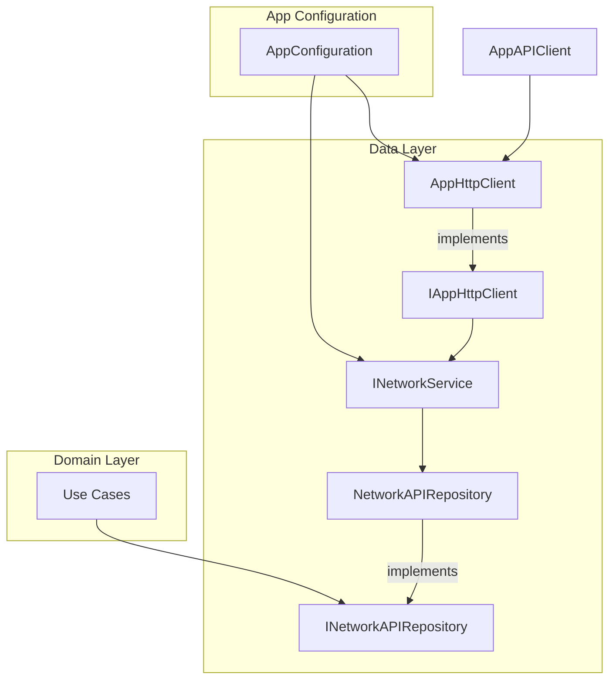
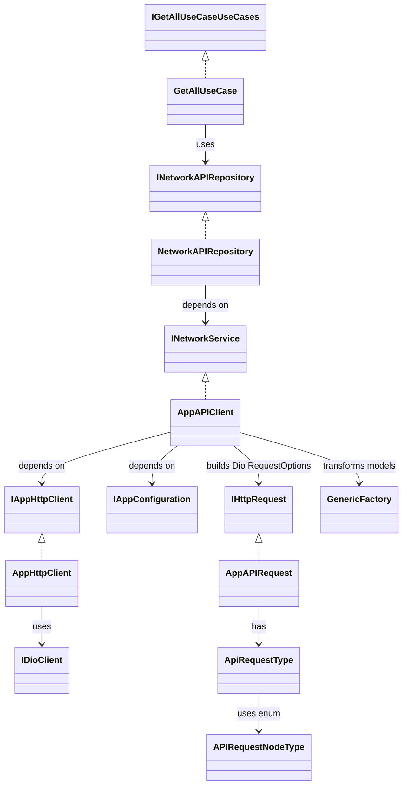

# Rest API Data Layer in Flutter using abstraction, layered architecture and depencency injection

# Data Layer Documentation

This documentation describes the architecture, abstractions, and flow of the `data_layer`. The design leverages clean architecture principles, dependency injection, abstraction, and enums to provide a scalable, maintainable, and testable REST API client.

---

## Architectural Overview

The data layer is responsible for:

- Abstracting network communication from domain and presentation layers.
- Providing a scalable and configurable REST API client.
- Enabling easy addition of new API endpoints via enums and abstraction.
- Handling deserialization, error mapping, and environment configuration.
- Facilitating unit testing and code reusability by using dependency injection and interfaces.

## Architecture Diagram



### The data layer is implemented using **Clean Architecture**, which emphasizes:

- **Separation of concerns:** Each layer has a single responsibility.
- **Abstraction:** Interfaces and abstract classes decouple implementation from usage.
- **Dependency Injection:** All dependencies are provided externally, enabling easy testing and reusability.
- **Layered Architecture:** Clear distinction between data, domain, and presentation layers.

### Layered Structure

- **Presentation Layer:** UI, ViewModels, etc.
- **Domain Layer:** Use cases, business logic, abstract repositories.
- **Data Layer:** Concrete implementations, network services, DTOs, mappers.

---

## Core Concepts & Classes

### 1. Abstraction & Interfaces

#### IHttpRequest

- **Role:** Defines the contract for creating REST API requests.
- **Purpose:** Allows for multiple implementations, enabling extensibility.


#### INetworkService

- **Role:** Abstracts network request execution.
- **Main Method:**
  ```dart
  Future<ApiResult<T>> loadRequest<T>(IHttpRequest request);
  ```
- **Purpose:** Allows repositories to issue requests without knowing implementation details.

#### IAppHttpClient

- **Role:** Abstraction over HTTP client (e.g., Dio).
- **Purpose:** To execute requests and return raw or JSON data.

#### IAppConfiguration

- **Role:** Abstraction for environment configuration.
- **Purpose:** Provides base URLs and other environment-dependent values.

#### INetworkAPIRepository

- **Role:** The only interface exposed to the domain and presentation layers.
- **Purpose:** Offers high-level methods for different endpoints, abstracting all lower-level networking details.

---

### 2. Implementations

#### AppAPIRequest (implements IHttpRequest)

- Concrete implementation for building REST API requests.
- Uses `ApiRequestType` for dynamic endpoint configuration.

#### ApiRequestType (abstract class)

- **Role:** Abstracts multiple request types/endpoints.
- **Endpoint Selection:** Uses `APIRequestNodeType` enum.
- **Methods:** 
  - `customHeaders()`
  - `accessTokenHeaders()`
  - `isContentLengthHeaderRequired()`
  - `responseType()`
  - `nodeUrlEndPoint()`
- **Pattern:** Each method uses a `switch-case` on the enum for dynamic configuration.

#### APIRequestNodeType (enum)

- **Role:** Defines all REST API node types/endpoints.
- **Purpose:** Adding a new endpoint requires only a new enum value and corresponding switch-case logic, leading to high configurability and readability.

#### AppAPIClient (implements INetworkService)

- **Dependencies:** Injects `IAppHttpClient` and `IAppConfiguration`.
- **Responsibilities:**
  - Executes HTTP requests using the injected client.
  - Uses configuration to select environment/base URL.
  - Transforms JSON to data model in a background thread using `GenericFactory`.
  - Requires all models to be registered with `GenericFactory`.

#### AppHttpClient (implements IAppHttpClient)

- **Uses:** `IDioClient` for REST API calls.
- **Responsibilities:**
  - Executes HTTP requests.
  - Maps Dio exceptions to `AppNetworkResponseException`.
  - `AppNetworkResponseException` is domain layer exception to avoid dependency of Dio package.

#### Exception Handling
- Maps `AppNetworkResponseException` to `NetworkExceptions` for UI-friendly error messages in domain layer
- **Role:** Exception abstraction and error mapping.
- **Purpose:** Improves readability and user messaging for error scenarios.

---

## Clean Architecture & Dependency Injection

- All core components (services, clients, repositories) are injected via constructors.
- Interfaces are used throughout, allowing for unit testing and easy swapping/mocking of implementations.
- **No concrete implementation is directly referenced in the domain or presentation layers.**
- **INetworkAPIRepository** is the bridge between domain/business logic and the data layer.

---

## Example Use Case: Fetching Brand Data

The following is an example of a domain use case that is cleanly separated from implementation details using dependency injection and abstraction:

```dart
abstract class IGetAllUseCaseUseCases {
  Future<List<BrandDTO>> fetchAllBrandData();
}

class GetAllUseCase implements IGetAllUseCaseUseCases {
  final INetworkAPIRepository _networkAPIRepository;

  GetAllUseCase(this._networkAPIRepository);

  @override
  Future<List<BrandDTO>> fetchAllBrandData() async {
    ApiResult<GetBrandsResponse> result =
        await _networkAPIRepository.getDataAll(APIRequestNodeType.brand);
    return result.when(
        success: (success) {
          if (success != null && success.status == "success") {
            return success.data ?? [];
          } else {
            return throw const NetworkExceptions.notFound("Data not available");
          }
        },
        failure: (failure) => throw failure);
  }
}
```

**Explanation:**

- The use case (`GetAllUseCase`) depends only on the `INetworkAPIRepository` interface.
- It doesn't know about HTTP, endpoints, or API specifics—the data layer handles those via abstraction and enums.
- All dependencies are injected, supporting clean architecture and testability.
- Error handling is uniform and mapped to user-friendly exceptions.

---

## Layered Architecture & Dependency Flow



---

## How It Works: Request Flow

1. **Domain Layer:**  
   Use case (e.g., `fetchAllBrandData`) calls the repository `INetworkAPIRepository`, supplying an `APIRequestNodeType` and required parameters.
2. **Repository Layer:**  
   Calls `INetworkService` (implemented by AppAPIClient) calls method `loadRequest`, supplying an `IHttpRequest` parameter.
3. **Request Construction:**  
   `AppAPIClient` builds an `RequestOptions` using `IHttpRequest` (implemented by `AppAPIRequest`)
4. **Request Execution:**  
  `IAppHttpClient` (implemented by `AppHttpClient`) executes the HTTP request using `IDioClient` (Dio library).
5. **Error Handling:**  
   Dio exceptions are mapped to `AppNetworkResponseException`, and then to domain-specific `NetworkExceptions` for better UI messaging.
6. **Response Parsing:**
   `AppAPIClient` uses `GenericFactory` to convert JSON responses into Dart data models on a background thread. All models must be registered with `GenericFactory`.
7. **Return Value:**  
   The result, or a parsed error, is returned to the repository (and thus, to the domain/presentation layer).
8. **Result:**  
   Clean, strongly-typed data or exceptions are returned up the chain.

---

## Key Benefits

- **Clean Architecture:** Strict boundaries and dependency rules.
- **Abstraction:** All core logic is interface-driven.
- **Dependency Injection:** Enables easy mocking and testability.
- **Highly Configurable:** Adding endpoints is as simple as updating an enum and a switch-case.
- **Layered:** Presentation, domain, and data are decoupled.
- **Extensible:** Enum-driven architecture allows for rapid expansion without affecting existing code.
- **Readability:** The use of switch-cases on enums makes endpoint logic explicit and easy to follow.
- **Consistent Error Handling:** All errors are mapped for readability and UI presentation.
- **Performance:** JSON parsing is offloaded to background threads.


---

## Inputs for Further Improvement

- **Automated Model Registration:** Consider code generation for `GenericFactory` to reduce manual registration errors.
- **API Versioning:** Encapsulate versioning logic in `ApiRequestType` for easier upgrade paths.
- **Retry/Timeout Logic:** Add configurable retry strategies in `AppHttpClient`.
- **Metrics & Logging:** Integrate network metrics and detailed logging for observability.
---

## Summary
The data layer is a robust, testable, and scalable foundation for REST API communication in Flutter. It fully embraces clean architecture, dependency injection, and interface-driven design, ensuring maintainability and extensibility as your application grows.
